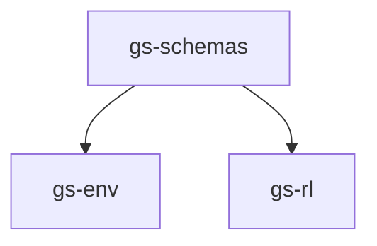

# Genesis Playground

## Overview

The playground is built with a modular design that separates concerns:



- **`gs-schemas`** - Shared data structures and interfaces
- **`gs-env`** - Robot simulation and real-world environments
- **`gs-rl`** - Reinforcement learning algorithms and training
- **`scripts`** - Ready-to-run examples and demos

## Quick Start

### 1. Install Dependencies

```bash
# Install uv (fast Python package manager)
curl -LsSf https://astral.sh/uv/install.sh | sh

# Clone and setup the playground
git clone <your-repo-url>
cd gs-playground
```

### 2. Install the `gs-env` package and its dependencies in an isolated environment:

```bash
uv sync --package gs-env
```

### 3. Activate the environment with

```bash
source .venv/bin/activate
```


### 4. Run RL training for a simple `goal-reaching` task in simulation:

```bash
python3 scripts/run_ppo_train.py
```
