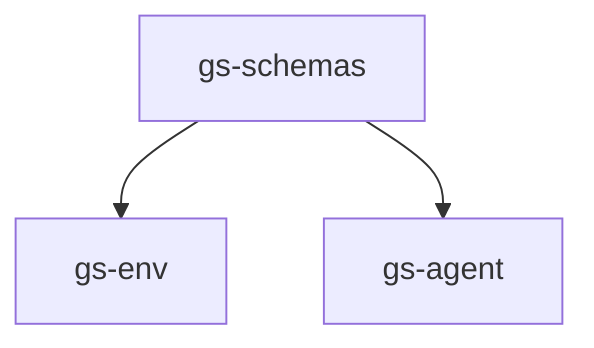

# Genesis Playground


## Overview
**Genesis Playground** is an open-source sandbox for building and sharing Robot Learning applications on top of the [Genesis](https://github.com/Genesis-Embodied-AI/Genesis) simulator. It provides environments, agents, and typed schemas into one cohesive workspace so researchers and students can prototype quickly and compare methods fairly.

> **Note:** This project is for **education and research**. It is **not** an official Genesis product.


The playground is built with a modular design that separates concerns:



- **`gs-schemas`** - Shared data structures and interfaces
- **`gs-env`** - Robot simulation and real-world environments
- **`gs-agent`** - Robot learning algorithms
- **`examples`** - Ready-to-run examples and demos

## Quick Start

### 1. Install Dependencies

```bash
# Install uv (fast Python package manager)
curl -LsSf https://astral.sh/uv/install.sh | sh

# Clone and setup the playground
git clone git@github.com:yun-long/GenesisPlayground.git
cd GenesisPlayground
```

### 2. Install the `gs-env` package and its dependencies in an isolated environment:

```bash
uv sync --package gs-env
```

### 3. Activate the environment with

```bash
source .venv/bin/activate
```


### 4. Run RL training for a simple `inverted pendulum` task in simulation:

```bash
python3 examples/run_ppo_gym.py # OpenAI gym inverted pendulum
```

or
```bash
python3 examples/run_ppo_gs.py # Genesis example
```

## Teleop and Trajectory Recording

The playground includes a comprehensive teleop system for recording robot demonstrations and replaying them for behavior cloning and analysis.

### Recording Robot Demonstrations

Use the teleop interface to record robot demonstrations:

```bash
# Record demonstrations with Franka robot (pick cube task)
python examples/run_pick_cube_teleop.py
```

**Controls:**
- **WASD**: Move end-effector in X-Y plane
- **QE**: Move end-effector up/down (Z-axis)
- **IJKL**: Rotate end-effector orientation
- **Space**: Close/open gripper
- **R**: Reset scene
- **Esc**: Quit and save trajectory

**Recording Features:**
- Automatic trajectory saving to `trajectories/` directory
- Timestamped commands and observations
- Optimized data storage with minimal copying
- Real-time performance monitoring

### Replaying Recorded Trajectories

Replay recorded demonstrations for analysis or behavior cloning:

```bash
# Replay the latest recorded trajectory
python examples/replay_with_viewer.py

# Replay a specific trajectory file
python examples/replay_with_viewer.py --trajectory-file franka_pick_place_1757368298.pkl
```

**Replay Features:**
- Visual playback with Genesis viewer
- Step-by-step trajectory analysis
- Command and observation data access
- Compatible with behavior cloning algorithms
- Configurable filename prefix for different robots/tasks
- Support for replaying specific trajectory files

### Behavior Cloning

Train behavior cloning on gym environments:

```bash
# Train behavior cloning model on gym environment (Pendulum-v1)
python examples/run_bc_gym.py
```

### Trajectory Data Format

Recorded trajectories are saved as pickle files with the following structure: 

```python
{
    "metadata": {
        "env_name": "pick_cube_default",
        "robot_type": "franka",
        "recording_duration": 45.2,
        "num_steps": 4520,
        "timestamp": "2025-01-08T15:30:45"
    },
    "trajectory": [
        {
            "timestamp": 0.0,
            "command": {
                "position": [x, y, z],
                "orientation": [qw, qx, qy, qz],
                "gripper_close": 0.0,
                "reset_scene": False,
                "quit_teleop": False
            },
            "observation": {
                "ee_pose": [x, y, z, qw, qx, qy, qz],
                "cube_pos": [x, y, z],
                "cube_quat": [qw, qx, qy, qz]
            }
        },
        # ... more steps
    ]
}
```

## Development

### Running Tests and Linting

```bash
# Install pre-commit hooks
pre-commit install

# Run all checks
pre-commit run --all-files

# Run type checking
uv sync --package gs-env
pyright src/env

uv sync --package gs-agent  
pyright src/agent
```

## TODO

- [x] Address CI errors
- [x] Add coding guidelines
- [x] Add teleop interface and examples
- [x] Add BC algorithms
- [ ] Add more examples
