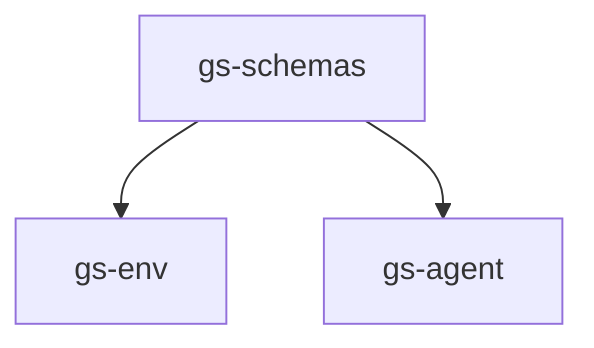

# Genesis Playground


## Overview
**Genesis Playground** is an open-source sandbox for building and sharing Robot Learning applications on top of the [Genesis](https://github.com/Genesis-Embodied-AI/Genesis) simulator. It provides environments, agents, and typed schemas into one cohesive workspace so researchers and students can prototype quickly and compare methods fairly.

> **Note:** This project is for **education and research**. It is **not** an official Genesis product.


The playground is built with a modular design that separates concerns:



- **`gs-schemas`** - Shared data structures and interfaces
- **`gs-env`** - Robot simulation and real-world environments
- **`gs-agent`** - Robot learning algorithms
- **`examples`** - Ready-to-run examples and demos

## Quick Start

### 1. Install Dependencies

```bash
# Install uv (fast Python package manager)
curl -LsSf https://astral.sh/uv/install.sh | sh

# Clone and setup the playground
git clone git@github.com:yun-long/GenesisPlayground.git
cd GenesisPlayground
```

### 2. Install the `gs-env` package and its dependencies in an isolated environment:

```bash
uv sync --package gs-env
```

### 3. Activate the environment with

```bash
source .venv/bin/activate
```


### 4. Run RL training for a simple `inverted pendulum` task in simulation:

```bash
python3 examples/run_ppo_gym.py # OpenAI gym inverted pendulum
```

or
```bash
python3 examples/run_ppo_gs.py # Genesis example
```

## TODO

- [ ] Address CI errors
- [ ] Add coding guidelines
- [ ] Add teleop interface and examples
- [ ] Add BC algorithms
